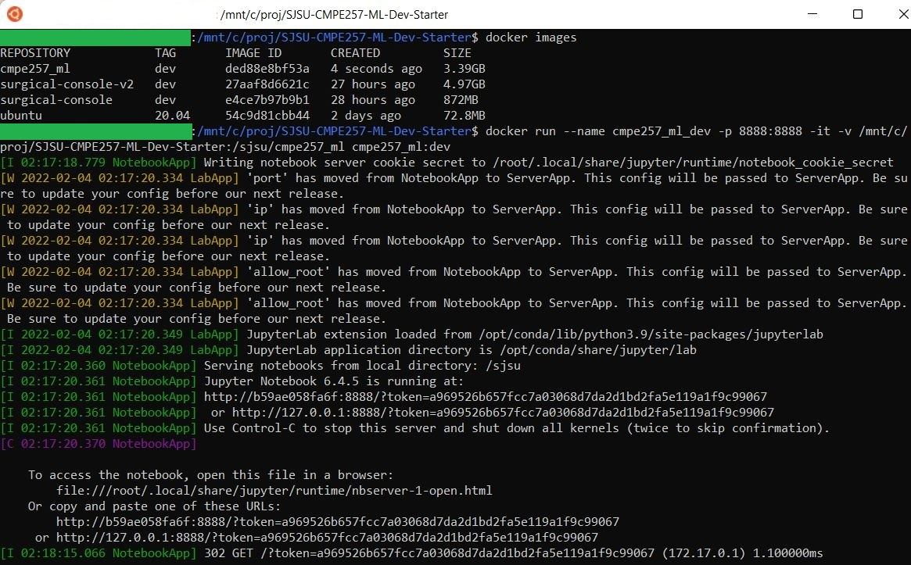
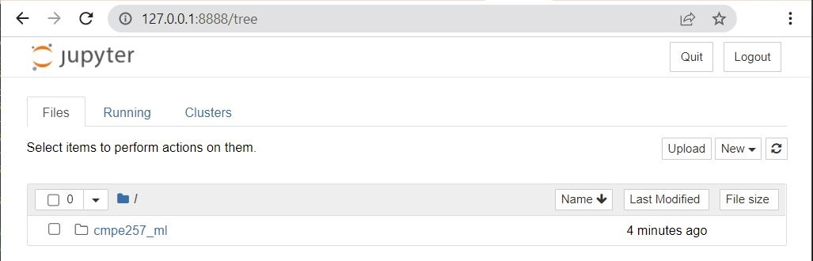

# SJSU CMPE257 ML Dev Starter

SJSU MS AI/CMPE/SE **CMPE 257 Machine Learning** Starter For Deploying Dev Environment in a Docker Container

## Prequisites

- Install Docker Desktop for your computer OS (Windows, Mac, Linux): https://www.docker.com/products/docker-desktop

- For Windows users, feel tree to try out Windows Subsystem for Linux(WSL2), such as Ubuntu 20.04 from Microsoft Store. Docker Desktop has integration with WSL2.

- For Windows, Mac and Linux, make sure you have `git` installed

## Deploy ML Dev Environment in a Docker Container

1\. Open your terminal, build the CMPE257 ML Dev Docker image from the Dockerfile:

~~~bash
# For Windows users, create proj/ folder in your c drive
mkdir -p /mnt/c/proj
cd /mnt/c/proj

# For Mac/Linux users, create proj/ dir in "/" dir, you might need
# admin privileges
mkdir -p /proj
cd /proj

# Clone cmpe257 ml dev starter repo to proj/ folder, you can use your own
git clone https://github.com/james94/SJSU-CMPE257-ML-Dev-Starter.git

# Head to cmpe257 ml dev starter folder
cd SJSU-CMPE257-ML-Dev-Starter

# Build cmpe257_ml dev docker image with Anaconda3 & Jupyter
docker build -t cmpe257_ml:dev .
~~~

2\. Deploy the CMPE257 ML Dev Docker container from our Docker image we just built:

~~~bash
# For Windows users, as we deploy our docker container, we'll create
# a volume mount point from the absolute path of our dev host /mnt/c/proj/
# folder's sjsu cmpe 257 ml starter dir to /sjsu/cmpe257_ml folder in our container
docker run --name cmpe257_ml_dev -p 8888:8888 -it -v /mnt/c/proj/SJSU-CMPE257-ML-Dev-Starter:/sjsu/cmpe257_ml cmpe257_ml:dev

# For Mac/Linux users, as we deploy our docker container, we'll create
# a volume mount point from the absolute path of our dev host /proj/
# folder's sjsu cmpe 257 ml starter dir to /sjsu/cmpe257_ml folder in our container
docker run --name cmpe257_ml_dev -p 8888:8888 -it -v /proj/SJSU-CMPE257-ML-Dev-Starter:/sjsu/cmpe257_ml cmpe257_ml:dev
~~~

Here's a view of what you should see in your terminal:

So now we can work on the Python code for our ML Application from our Windows, Mac, or Linux dev host and those updates will show up in our Docker container's volume mounted point. This is also true if we work directly from our Jupyter Web App that has direct connection to our Docker container, the volume mounted point on our dev host will be updated with any new Jupyter Notebooks we create and any new Python code we write.

3\. Once the Docker container is deployed, you should see in your terminal a URL with the hostname and token in the web address where your Jupyter Notebook Web App is running:

~~~bash
# URL will look like below, but <hostname> and <token> will be filled
"http://<hostname>:8888/?token=<token>"
~~~

URL Example: `http://127.0.0.1:8888/?token=a969526b657fcc7a03068d7da2d1bd2fa5e119a1f9c99067`

You should see Jupyter in your web browser now.

References:

- https://hub.docker.com/r/continuumio/anaconda3
- https://www.docker.com/products/docker-desktop
